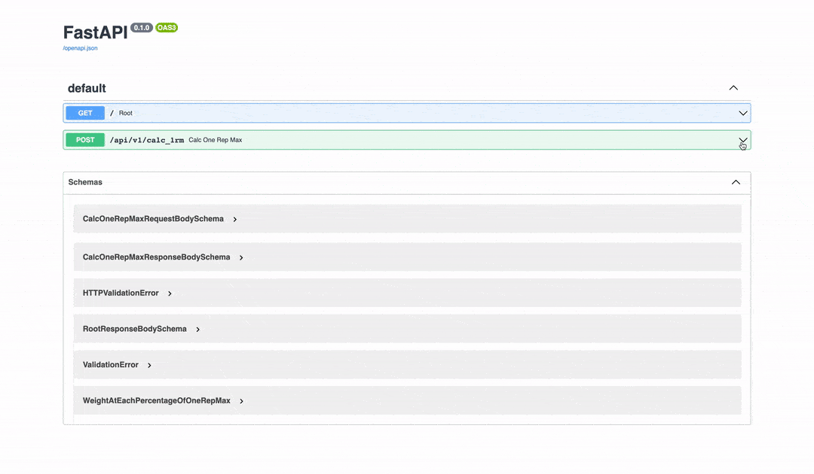

<div align="center">

# One-repetition maximum Calculation API

**A simple API to calculate 1RM.**

**[Documentation](https://one-rep-max-calc-api.herokuapp.com/docs)**

</div>

<br />

**1RM** is the maximum weight that can be lifted at one time.

> **One-repetition maximum** (**one rep maximum** or **1RM**) in weight training is the maximum amount of weight that a person can possibly lift for one repetition. 
> It may also be considered as the maximum amount of force that can be generated in one maximal contraction.[1] 
> One repetition maximum can be used for determining an individuals maximum strength and is the method for determining the winner in events such as powerlifting and weightlifting competitions. 
> One repetition maximum can also be used as an upper limit, in order to determine the desired "load" for an exercise (as a percentage of the 1RM).
> https://en.wikipedia.org/wiki/One-repetition_maximum

<br />
<br />

## Features

- [x] You can get the value of **1RM** by sending _weight_ and _reps_.
- [x] Also, you can get the weight at each percentage of 1RM.

<br />

## Demo

- **You can try it out on the [document page](https://one-rep-max-calc-api.herokuapp.com/docs).**



<br />

or

<br />

- **Try the curl command below.**


```sh
curl -X 'POST' \
'https://one-rep-max-calc-api.herokuapp.com/api/v1/calc_1rm' \
-H 'accept: application/json' \
-H 'Content-Type: application/json' \
-d '{
  "weight": 52.5,
  "reps": 10
}'
```

<br />

## Tech Stack

- **Framework: [FastAPI](https://fastapi.tiangolo.com)**
- **Deployment: [Heroku](https://heroku.com)**

<br />

## License
MIT
